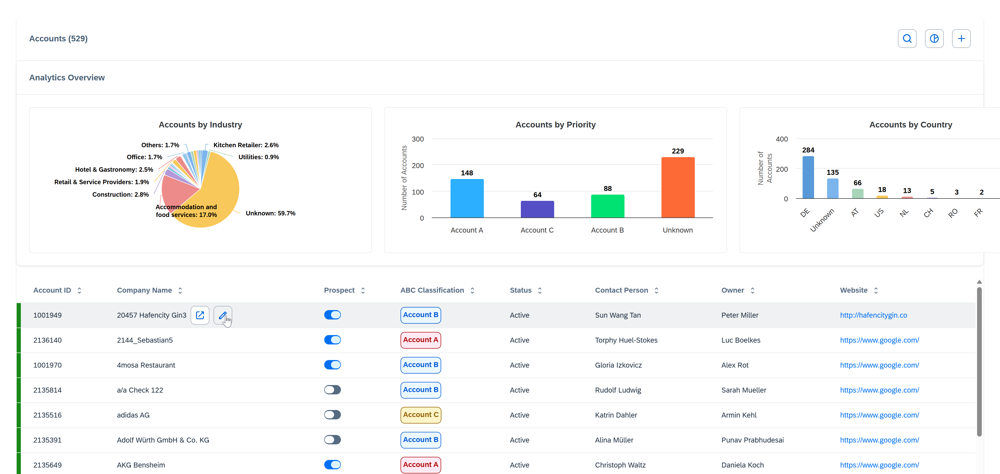
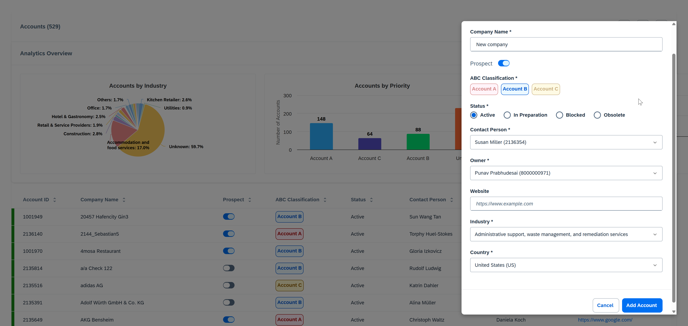

# SAP Sales and Service Cloud V2 - Vue.js Accounts App

A production-ready Vue.js frontend **connected to SAP Sales and Service Cloud Version 2 REST API** with **SAP Sales and Service Cloud V2** CSS styling. This application demonstrates how to build enterprise-grade, accessible, and secure table-based interfaces with full CRUD operations against live CRM data looking exactly like the standard UI's.

**👉 [tl;tr: Check the video where I showcase the app and the CSS styles:](https://sapvideo.cfapps.eu10-004.hana.ondemand.com/?entry_id=1_nf07mpft)**

## 🎯 Purpose

This project serves as a **reference implementation** for developers building modern frontends for SAP Sales and Service Cloud V2 environments. It showcases:

- ✅ **Live SAP CRM API Integration** - Real-time data from Sales & Service Cloud V2
- ✅ **Secure Authentication** - Express proxy server with Basic Auth (credentials never exposed to client)
- ✅ **Modern Vue 3** with Composition API and TypeScript
- ✅ **SAP Fiori Design System** (Sales & Service Cloud V2 variation) - [Complete CSS Style Guide](docs/CSS-STYLE-GUIDE.md) 🎨
- ✅ **Interactive CSS Showcase** - [Live component examples](/public/css-showcase.html) with copy-able code snippets 🚀
- ✅ **Reactive State Management** with Pinia
- ✅ **Full CRUD Operations** - Create, Read, Update, Delete with optimistic locking (If-Match)
- ✅ **Server-Side Pagination** - Efficient data loading with OData $top/$skip/$count
- ✅ **Advanced Features** - Sorting, search, filtering, dropdown data from API, analytics dashboard
- ✅ **Cloud Foundry Ready** - Deployment configuration for SAP BTP
- ✅ **Accessibility** - WCAG 2.1 AA compliant
- ✅ **Entity Migration Guide** - Easy adaptation to other entities (Opportunities, Leads, etc.)

## 🎨 Interactive CSS Design System Showcase

**NEW!** Explore the complete SAP Sales and Service Cloud V2 design system with live, interactive examples:

👉 **[Open CSS Showcase Page](/public/css-showcase.html)** 👈

The showcase includes:
- 🎨 **Color System** - Complete color palette with swatches and variable names
- 🔘 **Buttons** - All variants, sizes, and toggle buttons
- 📋 **Forms** - Inputs, selects, textareas, checkboxes, radios, switches
- 📊 **Tables** - Table structure, row states, status indicators
- 🏷️ **Badges** - All semantic colors
- 🔍 **Filters** - Filter dropdowns and active filter pills
- 📄 **Pagination** - Page controls and items-per-page selectors
- 📱 **Modals** - Dialog structure and form layouts
- **Copy-to-clipboard** code snippets for every component
- **Framework-agnostic** - Works with Vue, React, Angular, or plain HTML

Access it from the app by clicking the "CSS Guide" button in the header, or visit `/css-showcase.html` directly.

## 📸 Screenshots

### Accounts Overview with Table View


The main accounts page displays a sortable, searchable table with:
- Server-side pagination with configurable page sizes
- Multi-column sorting with visual indicators
- Real-time search across all account fields
- Color-coded priority badges (High/Medium/Low)
- Row state indicators (Active/Inactive/Review)
- Inline edit and delete actions
- Accounts by Industry (pie chart)
- Accounts by Priority (column chart)
- Key performance metrics and statistics
- Real-time data visualization

### Modal Dialogue for Entitity Creation


---

## � Blog Post & Video Tutorial

🎨 **Want to learn more about creating custom frontends that look like SAP Sales and Service Cloud V2?**

I've written a comprehensive blog post with a detailed video walkthrough that demonstrates:
- ✨ How this application achieves pixel-perfect SAP design system replication
- 🎬 Live demonstration of the CSS style guide
- 📖 Step-by-step guide through the complete styling system
- 🔧 Tips and best practices for SAP-styled custom UIs

**👉 [Read the full blog post and watch the video](https://community.sap.com/t5/crm-and-cx-blog-posts-by-sap/styling-your-custom-frontend-like-sap-sales-and-service-cloud-v2/ba-p/14305503)**

The blog post covers:
- **Why custom styling matters** for side-by-side extensions
- **Complete CSS architecture** breakdown (3-file system)
- **Interactive component showcase** with live examples
- **Real-world implementation** patterns and tips
- **Video tutorial** walking through the entire design system

Perfect for developers who want to create **professional, SAP-native-looking extensions** that seamlessly integrate with Sales and Service Cloud V2! 🚀

---

## �📋 Table of Contents

1. [Quick Start](#-quick-start)
2. [Features](#-features)
3. [Documentation](#-documentation)
4. [Project Structure](#-project-structure)
5. [Component Catalog](#-component-catalog)
6. [Composables & Patterns](#-composables--patterns)
7. [State Management](#-state-management)
8. [How to Add New Data Entities](#-how-to-add-new-data-entities)
9. [SAP CRM API Integration](#-sap-crm-api-integration)
10. [Additional Resources](#-additional-resources)
11. [Security](#-security)
12. [Tips & Best Practices](#-tips--best-practices)
13. [TODO / Future Items](#-todo--future-implementation-items)

---

## 🚀 Quick Start

### Prerequisites

- Node.js 18+ and npm
- SAP Sales and Service Cloud V2 API credentials
- Basic knowledge of Vue 3 and TypeScript

### Installation & Setup

```bash
# 1. Install dependencies
npm install

# 2. Configure server credentials
cd server
copy env-template.txt .env
# Edit server/.env with your SAP CRM credentials

# 3. Start both frontend and backend
cd ..
npm run dev
```

**The application will be available at:**
- Frontend (Vue + Vite): `http://localhost:5173`
- Backend (Express proxy): `http://localhost:3000`

### Configuration

Edit `server/.env` with your SAP CRM credentials:

```env
CRM_BASE_URL=https://your-tenant.crm.cloud.sap
CRM_USERNAME=your-username
CRM_PASSWORD=your-password
PORT=3000
NODE_ENV=development
```

**Security Note:** The `server/.env` file is git-ignored. Credentials are stored server-side only and never exposed to the client.

### Build & Deploy

```bash
# Build for production
npm run build

# Start production server (serves built files + API proxy)
npm start

# Deploy to SAP BTP Cloud Foundry
cf push
# See docs/DEPLOYMENT.md for complete instructions
```

---

## ✨ Features

### Core Functionality
- ✅ **Full CRUD Operations** - Create, read, update, and delete accounts with API integration
- ✅ **Server-Side Pagination** - Efficient data loading with configurable page sizes (10, 25, 50, 100 items)
- ✅ **Real-Time Search** - Instant filtering across multiple fields (ID, name, contact, owner, status, industry)
- ✅ **Column Sorting** - Click any column header to sort ascending/descending/unsorted
- ✅ **Optimistic Locking** - If-Match headers prevent concurrent edit conflicts
- ✅ **Dynamic Dropdowns** - Populated from live API data (contacts, owners, industries, countries)

### User Interface
- ✅ **SAP Fiori Design** - Professional enterprise UI matching SAP Sales & Service Cloud V2 styling
- ✅ **Responsive Layout** - Works seamlessly on desktop, tablet, and mobile devices
- ✅ **Animated Search** - Smooth expand/collapse animation with clear functionality
- ✅ **Visual Status Indicators** - Color-coded priority badges and row state indicators
- ✅ **Modal Dialogs** - Create and edit accounts in overlay forms with validation
- ✅ **Loading States** - Visual feedback during API operations
- ✅ **Error Handling** - User-friendly error messages for all operations

### Analytics Dashboard
- ✅ **Accounts by Industry** - Pie chart showing distribution across industries
- ✅ **Accounts by Priority** - Column chart comparing High/Medium/Low priority accounts
- ✅ **Key Metrics** - Total accounts, active accounts, and prospect counts

### Developer Experience
- ✅ **TypeScript** - Full type safety across the entire application
- ✅ **Composables** - Reusable Vue composition functions for common patterns
- ✅ **Pinia Store** - Centralized state management with devtools integration
- ✅ **Component Library** - 15+ reusable SAP-styled components
- ✅ **Hot Module Replacement** - Instant updates during development
- ✅ **ESLint & Prettier Ready** - Code quality and formatting standards

### Security
- ✅ **Credential Protection** - Basic Auth handled server-side, never exposed to browser
- ✅ **Express Proxy** - Secure authentication layer between frontend and SAP API
- ✅ **Environment Variables** - Sensitive data stored outside of code
- ✅ **CORS Protection** - Configured for development and production environments

### CRM Navigation Integration
- ✅ **Direct Entity Navigation** - Click Company Name, Contact Person, or Owner to open entity in CRM
- ✅ **Modal Action Menu** - Meatballs menu (⋯) in account edit modal for quick actions
- ✅ **window.postMessage API** - Seamless integration with SAP Sales & Service Cloud V2 shell
- ✅ **Quick View Support** - Opens entity details in overlay without leaving context
- ✅ **Smart Fallback** - Navigation links only appear when entity UUIDs are available

#### Table Navigation Links

The application uses the SAP Sales & Service Cloud V2 navigation API to enable direct navigation from table entries to their corresponding CRM entities. When users click on **Company Name**, **Contact Person**, or **Owner** fields, the application sends a `window.postMessage()` to the parent CRM shell with the following structure:

```javascript
{
  operation: 'navigation',
  params: {
    objectKey: '<entity-uuid>',      // UUID of the entity
    routingKey: '<entity-type>',     // mdaccount, mdcontact, or mdemployee
    viewType: 'quickview'            // Opens in overlay
  }
}
```

**Supported Entity Types:**
- **Company Name** → `mdaccount` (Account entity)
- **Contact Person** → `mdcontact` (Contact entity)
- **Owner** → `mdemployee` (Employee entity)

**Implementation Details:**
- Navigation links are styled with semi-bold font weight and dark grey color (#1D2D3E)
- Hover effect shows underline to indicate interactivity
- Click events use `@click.stop` to prevent row selection
- Conditional rendering: links only appear when entity UUID is available
- Falls back to plain text when UUID is missing

**Code Location:**
- Navigation function: [`SapTableRow.vue`](src/components/SapTableRow.vue) - `navigateToCrm()` method
- Navigation styles: [`sap-crm-components.css`](src/assets/css/sap-crm-components.css) - `.sap-crm-table__nav-link` class

#### Modal Action Menu (Meatballs Menu)

When editing an existing account, a **meatballs menu** (three horizontal dots ⋯) appears in the modal header, providing quick access to related CRM actions:

**Menu Actions:**
1. **Open Account Details** - Opens full account details view in CRM
   - Routing Key: `mdaccount`
   - View Type: `details`
   
2. **Create Opportunity** - Creates new opportunity linked to current account
   - Routing Key: `guidedselling`
   - View Type: `quickcreate`
   
3. **Create Quote** - Creates new quote for current account
   - Routing Key: `sales-quote`
   - View Type: `quickcreate`
   
4. **Create Case** - Creates new support case with account context
   - Routing Key: `case`
   - View Type: `quickcreate`
   - Includes account ID in attributes

**Example postMessage Structure:**
```javascript
// Create Case with account context
{
  operation: 'navigation',
  params: {
    routingKey: 'case',
    viewType: 'quickcreate',
    attributes: {
      BuyerPartyID: '<account-uuid>'
    }
  }
}
```

**UI/UX Features:**
- Menu only appears in **edit mode** (when viewing existing account)
- Click outside menu to close automatically
- Menu resets when modal closes/reopens
- Styled to match SAP Fiori secondary buttons
- Smooth transitions and light gray hover effect

**Code Location:**
- Modal menu component: [`AccountModal.vue`](src/components/AccountModal.vue) - Navigation functions and menu template
- Menu styles: [`sap-crm-components.css`](src/assets/css/sap-crm-components.css) - `.sap-crm-modal-menu` classes
- Icon: [`SapIcon.vue`](src/components/SapIcon.vue) - `meatballs` icon type

**Official Documentation:**
For complete details on the SAP Sales & Service Cloud V2 navigation API, see:
📖 [SAP Help: Navigation via postMessage](https://help.sap.com/docs/help/23ec04ee830846958605622f27ff5c3d/e4ce508cf44f413faa7f1bc5fb4537bb.html)

---

## 📚 Documentation

This project includes comprehensive documentation for all aspects of development and deployment:

### Getting Started
- **[QUICKSTART.md](docs/QUICKSTART.md)** - Complete setup guide with troubleshooting
  - First-time installation steps
  - Running in development mode
  - Testing the API integration
  - Common issues and solutions

### Deployment
- **[DEPLOYMENT.md](docs/DEPLOYMENT.md)** - SAP BTP Cloud Foundry deployment guide
  - Prerequisites and CF CLI setup
  - Step-by-step deployment instructions
  - Environment variable configuration
  - Scaling and monitoring
  - Security best practices

### Technical Documentation
- **[IMPLEMENTATION-SUMMARY.md](docs/IMPLEMENTATION-SUMMARY.md)** - Complete technical implementation details
  - All changes made during development
  - Data model documentation
  - API endpoint mappings
  - Architecture diagrams
  - Field mapping reference

### Migration Guide
- **[README-ENTITY-MIGRATION.md](docs/README-ENTITY-MIGRATION.md)** - Adapt this app to other CRM entities
  - Step-by-step migration process
  - TypeScript interface patterns
  - API service templates
  - Example: Opportunities entity
  - Best practices and tips

### Design & Styling
- **[CSS-STYLE-GUIDE.md](docs/CSS-STYLE-GUIDE.md)** - 🎨 **Complete SAP Fiori CSS Style Guide**
  - Reusable CSS for any framework (Vue, React, Angular, pure HTML)
  - Color system with CSS custom properties
  - All UI components (tables, buttons, inputs, forms)
  - 10 ready-to-use SVG icons with full code
  - Accessibility guidelines and best practices
  - Framework integration examples
  - **Perfect for building consistent SAP-styled interfaces**

### Additional Resources
- **[prompt-example.md](docs/prompt-example.md)** - Example prompts for generating similar applications
- **[env-template.txt](server/env-template.txt)** - Server environment variable template
- **[env-template-frontend.txt](env-template-frontend.txt)** - Frontend environment variable template

---

## 📁 Project Structure

```
V2Frontend2/
├── server/                          # Express proxy server (Backend)
│   ├── index.js                     # API proxy with Basic Auth
│   ├── package.json                 # Server dependencies
│   ├── .env                         # Credentials (git-ignored)
│   └── env-template.txt             # Environment template
├── src/                             # Vue application (Frontend)
│   ├── assets/
│   │   └── css/                    # SAP CRM Design System CSS
│   │       ├── sap-crm-colors.css   # Color custom properties
│   │       ├── sap-crm-global.css   # Global styles & typography
│   │       └── sap-crm-components.css # UI component styles
│   ├── components/                  # Reusable Vue components
│   │   ├── AccountModal.vue         # Create/Edit account modal
│   │   ├── AnalyticsPanel.vue       # Charts and analytics
│   │   ├── SapButton.vue           # Button component
│   │   ├── SapIcon.vue             # SVG icon component
│   │   ├── SapInput.vue            # Input field wrapper
│   │   ├── SapPagination.vue       # Pagination controls
│   │   ├── SapPriorityToggle.vue   # Priority toggle buttons
│   │   ├── SapRadioGroup.vue       # Radio button group
│   │   ├── SapSearchBox.vue        # Animated search box
│   │   ├── SapSelect.vue           # Dropdown select
│   │   ├── SapSwitch.vue           # Toggle switch
│   │   ├── SapTable.vue            # Table wrapper
│   │   ├── SapTableHeader.vue      # Sortable table header
│   │   └── SapTableRow.vue         # Table row with actions
│   ├── composables/                # Reusable composition functions
│   │   ├── useModal.ts             # Modal state management
│   │   ├── usePagination.ts        # Pagination logic
│   │   ├── useSearch.ts            # Search/filter logic
│   │   └── useTableSort.ts         # Table sorting logic
│   ├── data/
│   │   └── accounts.json           # Mock data (fallback)
│   ├── services/
│   │   └── api.ts                  # API client with mappers
│   ├── stores/
│   │   └── useAccountStore.ts      # Pinia store with API integration
│   ├── types/
│   │   └── index.ts                # TypeScript type definitions
│   ├── views/
│   │   └── AccountsPage.vue        # Main accounts page
│   ├── App.vue                     # Root component
│   ├── main.ts                     # Application entry point
│   └── style.css                   # Global styles import
├── public/                          # Static assets
├── .cfignore                        # CF deployment exclusions
├── manifest.yml                     # Cloud Foundry deployment config
├── vite.config.ts                   # Vite configuration (includes proxy)
├── tsconfig.json                    # TypeScript configuration
├── package.json                     # Root dependencies and scripts
├── docs/                            # Documentation
│   ├── QUICKSTART.md               # Quick start guide
│   ├── DEPLOYMENT.md               # Cloud Foundry deployment guide
│   ├── README-ENTITY-MIGRATION.md  # Entity migration guide
│   ├── IMPLEMENTATION-SUMMARY.md   # Technical implementation details
│   ├── CSS-STYLE-GUIDE.md         # SAP Fiori CSS style guide
│   └── prompt-example.md          # Example prompts for generation
└── README.md                        # This file

```
┌────────────────────────────────────────────────────────────┐
│              Browser (http://localhost:5173)               │
│  ┌──────────────────────────────────────────────────────┐ │
│  │  Vue.js App                                          │ │
│  │  - Pinia Store (State)                               │ │
│  │  - API Client (services/api.ts)                      │ │
│  │  - UI Components                                     │ │
│  │  - Calls: fetch('/api/accounts')                     │ │
│  └──────────────────────────────────────────────────────┘ │
└────────────────────────────────────────────────────────────┘
         │ Vite Dev Proxy (development)
         ▼
┌────────────────────────────────────────────────────────────┐
│     Express Proxy Server (http://localhost:3000)          │
│  ┌──────────────────────────────────────────────────────┐ │
│  │  - Receives /api/* requests                          │ │
│  │  - Adds Authorization: Basic {credentials}           │ │
│  │  - Forwards to SAP CRM API                           │ │
│  │  - Returns response to client                        │ │
│  └──────────────────────────────────────────────────────┘ │
│  Environment Variables (server/.env):                      │
│  - CRM_BASE_URL (never exposed to client)                  │
│  - CRM_USERNAME (never exposed to client)                  │
│  - CRM_PASSWORD (never exposed to client)                  │
└────────────────────────────────────────────────────────────┘
         │ HTTPS + Basic Auth
         ▼
┌────────────────────────────────────────────────────────────┐
│         SAP Sales & Service Cloud V2 API                   │
│  https://your-tenant.crm.cloud.sap                        │
│  /sap/c4c/api/v1/account-service/accounts                 │
│  /sap/c4c/api/v1/contact-person-service/contactPersons    │
│  /sap/c4c/api/v1/employee-service/employees               │
│  /sap/c4c/api/v1/business-partner-service/industrialSectors│
└────────────────────────────────────────────────────────────┘
```

### Data Flow with Live API

```
[SAP CRM API]
    ↓ (Express Proxy with Basic Auth)
[API Client (services/api.ts)]
    ↓ (Field Mapping: displayId → accountId, etc.)
[useAccountStore (Pinia)]
    ↓ (Reactive State)
[AccountsPage]
    ↓
[useSearch] → [filteredItems]
    ↓
[useTableSort] → [sortedItems]
    ↓
[SapTable] → Display
    ↓
[User Action: Edit] → [AccountModal]
    ↓
[Save] → [API Client.updateAccount()]
    ↓ (If-Match header for optimistic locking)
[SAP CRM API] → Update
    ↓
[Reactive Update] → UI automatically refresh
    ↓
[SapTable] → Display
    ↓
[User Action: Edit] → [AccountModal]
    ↓
[Save] → [useAccountStore.updateAccount()]
    ↓
[Reactive Update] → UI automatically updates
```

---

## 🧩 Component Catalog

### Atomic Components (Building Blocks)

#### **SapButton.vue**
Multi-variant button following SAP design system.

**Props:**
- `variant`: `'primary' | 'secondary' | 'neutrallight'` (default: `'primary'`)
- `size`: `'xsm' | 'sm' | 'md' | 'lg'` (default: `'md'`)
- `iconOnly`: `boolean` - Square icon-only button
- `disabled`: `boolean`
- `type`: `'button' | 'submit' | 'reset'`

**Usage:**
```vue
<SapButton variant="primary" @click="handleClick">
  Save Changes
</SapButton>

<SapButton variant="secondary" size="sm" icon-only>
  <SapIcon type="plus" />
</SapButton>
```

---

#### **SapInput.vue**
Input field wrapper with error and disabled states.

**Props:**
- `modelValue`: `string` (v-model)
- `type`: `'text' | 'email' | 'url' | 'tel'`
- `placeholder`: `string`
- `required`: `boolean`
- `disabled`: `boolean`
- `error`: `boolean`
- `id`: `string`

**Usage:**
```vue
<SapInput
  v-model="form.email"
  type="email"
  placeholder="email@example.com"
  :required="true"
/>
```

---

#### **SapSwitch.vue**
Toggle switch for boolean values.

**Props:**
- `modelValue`: `boolean` (v-model)
- `id`: `string`
- `disabled`: `boolean`

**Usage:**
```vue
<SapSwitch v-model="form.active" id="activeToggle" />
```

---

#### **SapPriorityToggle.vue**
Colored toggle buttons for priority selection (High/Medium/Low).

**Props:**
- `modelValue`: `Priority` ('High' | 'Medium' | 'Low') (v-model)

**Usage:**
```vue
<SapPriorityToggle v-model="form.priority" />
```

**Visual:** High (Red), Medium (Yellow), Low (Blue)

---

#### **SapRadioGroup.vue**
Radio button group component with SAP styling.

**Props:**
- `modelValue`: `string` (v-model)
- `name`: `string` - Radio group name
- `options`: `Array<{value: string, label: string}>`

**Usage:**
```vue
<SapRadioGroup
  v-model="form.status"
  name="status"
  :options="[
    { value: 'Active', label: 'Active' },
    { value: 'Inactive', label: 'Inactive' }
  ]"
/>
```

---

#### **SapSelect.vue**
Dropdown select component with SAP styling.

**Props:**
- `modelValue`: `string` (v-model)
- `options`: `Array<{value: string, label: string}>`
- `placeholder`: `string`
- `required`: `boolean`
- `disabled`: `boolean`

**Usage:**
```vue
<SapSelect
  v-model="form.industry"
  :options="industryOptions"
  placeholder="Select industry"
/>
```

---

#### **SapSearchBox.vue**
Animated search box with expand/collapse animation.

**Props:**
- `modelValue`: `string` (v-model for search term)

**Usage:**
```vue
<SapSearchBox v-model="searchTerm" />
```

---

#### **SapPagination.vue**
Pagination controls with page size selector.

**Props:**
- `currentPage`: `number`
- `totalPages`: `number`
- `pageSize`: `number`
- `totalItems`: `number`

**Emits:**
- `update:currentPage` - When page changes
- `update:pageSize` - When page size changes

**Usage:**
```vue
<SapPagination
  :current-page="currentPage"
  :total-pages="totalPages"
  :page-size="pageSize"
  :total-items="totalItems"
  @update:current-page="currentPage = $event"
  @update:page-size="pageSize = $event"
/>
```

---

#### **SapIcon.vue**
SVG icon component with predefined icons.

**Props:**
- `type`: `string` - Icon type (e.g., 'search', 'plus', 'edit', 'delete', 'sort', 'meatballs')
- `size`: `'sm' | 'md' | 'lg'`

**Available Icons:**
- UI actions: `search`, `plus`, `edit`, `delete`, `close`
- Sorting: `sort`, `sort-asc`, `sort-desc`
- Charts: `pie-chart`, `bar-chart`
- Actions: `refresh`, `filter`, `meatballs` (three-dot menu)

**Usage:**
```vue
<SapIcon type="search" size="md" />
<SapIcon type="meatballs" size="md" />
```

---

### Composite Components

#### **SapTable.vue**
Base table wrapper with styling.

**Slots:**
- Default slot for table content

**Usage:**
```vue
<SapTable>
  <thead><!-- headers --></thead>
  <tbody><!-- rows --></tbody>
</SapTable>
```

---

#### **SapTableHeader.vue**
Sortable table header cell.

**Props:**
- `column`: `TableColumn` - Column configuration
- `sortColumn`: `string | null` - Currently sorted column
- `sortDirection`: `'asc' | 'desc' | null`

**Emits:**
- `sort` - When header is clicked

**Usage:**
```vue
<SapTableHeader
  v-for="col in columns"
  :key="col.key"
  :column="col"
  :sort-column="sortColumn"
  :sort-direction="sortDirection"
  @sort="sortBy"
/>
```

---

#### **SapTableRow.vue**
Table row with state indicator and actions.

**Props:**
- `item`: `Account` - Row data
- `selected`: `boolean` - Selection state
- `columns`: `TableColumn[]` - Column definitions

**Emits:**
- `click` - When row is clicked
- `edit` - When edit button is clicked
- `delete` - When delete button is clicked

**Usage:**
```vue
<SapTableRow
  v-for="item in items"
  :key="item.id"
  :item="item"
  :selected="selectedId === item.id"
  :columns="columns"
  @edit="openEditModal(item)"
  @delete="deleteAccount(item.id)"
/>
```

---

#### **AccountModal.vue**
Create/Edit account modal dialog with CRM navigation menu.

**Props:**
- `isOpen`: `boolean`
- `mode`: `'create' | 'edit'`
- `account`: `Account | null` - Account data for edit mode

**Emits:**
- `close` - When modal is closed
- `save` - When form is submitted with account data

**Features:**
- Create and edit forms with validation
- Dropdown fields for Industry, Contact Person, Owner, Country
- **Meatballs menu** (⋯) in edit mode with CRM navigation actions:
  - Open Account Details in CRM
  - Create Opportunity for account
  - Create Quote for account
  - Create Case for account
- Click-outside to close menu
- Menu resets when modal opens/closes

**Usage:**
```vue
<AccountModal
  :is-open="isOpen"
  :mode="mode"
  :account="selectedAccount"
  @close="closeModal"
  @save="handleSave"
/>
```

---

#### **AnalyticsPanel.vue**
Analytics dashboard with charts.

**Props:**
- `accounts`: `Account[]` - Account data for analysis

**Usage:**
```vue
<AnalyticsPanel :accounts="accounts" />
```

---

## 🔧 Composables & Patterns

### useModal.ts

Manages modal state with create/edit mode support.

**Returns:**
```typescript
{
  isOpen: Ref<boolean>
  mode: Ref<'create' | 'edit'>
  openCreateModal: () => void
  openEditModal: () => void
  closeModal: () => void
}
```

**Features:**
- ESC key support (global keyboard listener)
- Automatic mode tracking

---

### useTableSort.ts

Client-side and server-side pagination logic.

**Returns:**
```typescript
{
  currentPage: Ref<number>
  pageSize: Ref<number>
  totalPages: Ref<number>
  paginatedItems: ComputedRef<T[]>
  goToPage: (page: number) => void
  nextPage: () => void
  previousPage: () => void
  setPageSize: (size: number) => void
}
```

**Features:**
- Client-side pagination for local data
- Server-side pagination with OData $skip and $top
- Configurable page sizes (10, 20, 30, 50)
- Automatic total pages calculation

---

### useTableSort.ts

Type-aware table sorting for various data types.

**Returns:**
```typescript
{
  sortColumn: Ref<string | null>
  sortDirection: Ref<'asc' | 'desc' | null>
  sortedItems: ComputedRef<T[]>
  sortBy: (column: string) => void
}
```

**Features:**
- **Text sorting**: Alphabetical (localeCompare)
- **Currency sorting**: Parses "$2.5M" to 2500000 for comparison
- **Account ID sorting**: Extracts numeric portion from "ACC-XXXX"
- **Boolean sorting**: Checkbox states (true=1, false=0)
- **Cycle behavior**: unsorted → asc → desc → unsorted

---

### useSearch.ts

Multi-field search and filtering.

**Returns:**
```typescript
{
  searchTerm: Ref<string>
  isSearchActive: Ref<boolean>
  filteredItems: ComputedRef<T[]>
  toggleSearch: () => void
  clearSearch: () => void
}
```

**Features:**
- Live filtering as user types
- Case-insensitive search
- Searches across multiple fields (configurable)
- Animated search box toggle
- Returns original array when search is empty

---

## 📦 State Management

### useAccountStore (Pinia)

Centralized state for account data with API-ready structure.

**State:**
```typescript
{
  accounts: Ref<Account[]>
  loading: Ref<boolean>
  error: Ref<string | null>
}
```

**Computed:**
```typescript
{
  activeAccounts: ComputedRef<Account[]>  // Filters accounts with Active status
}
```

**Actions:**

- `fetchAccounts(params?: ODataParams)` - Loads accounts from API with OData parameters
- `fetchAccountById(id: string)` - Fetches single account by ID
- `addAccount(account: CreateAccountDto)` - Creates new account via API
- `updateAccount(id: string, updates: Partial<Account>)` - Updates account with optimistic locking
- `deleteAccount(id: string)` - Deletes account via API
- `fetchIndustrialSectors()` - Loads industry dropdown options
- `fetchContactPersons()` - Loads contact person dropdown options
- `fetchEmployees()` - Loads owner dropdown options
- `fetchCountries()` - Loads country dropdown options

---

## 📝 How to Add New Data Entities

Follow this step-by-step guide to create similar interfaces for other entities (e.g., Contacts, Opportunities, Tickets).

### Step 1: Define TypeScript Interface

Create your entity interface in [src/types/index.ts](src/types/index.ts):

```typescript
export interface Contact {
  contactId: string
  firstName: string
  lastName: string
  email: string
  phone: string
  accountId: string
  role: ContactRole
  active: boolean
}

export type ContactRole = 'Decision Maker' | 'Influencer' | 'End User'
```

### Step 2: Create Pinia Store

Create a Pinia store in [src/stores/useYourEntityStore.ts](src/stores/) following the pattern in [useAccountStore.ts](src/stores/useAccountStore.ts):

```typescript
import { defineStore } from 'pinia'
import { ref } from 'vue'
import type { Contact } from '@/types'
import * as api from '@/services/api'

export const useContactStore = defineStore('contact', () => {
  const contacts = ref<Contact[]>([])
  const loading = ref(false)
  const error = ref<string | null>(null)
  
  async function fetchContacts() {
    loading.value = true
    try {
      contacts.value = await api.fetchContacts()
    } catch (e) {
      error.value = 'Failed to load contacts'
    } finally {
      loading.value = false
    }
  }
  
  return { contacts, loading, error, fetchContacts }
})
```

### Step 3: Create API Functions

Add API functions in [src/services/api.ts](src/services/api.ts) with proper mappers:

```typescript
// Mapper: SAP API → Frontend
const mapContactFromApi = (apiContact: any): Contact => ({
  contactId: apiContact.displayId,
  firstName: apiContact.firstName,
  lastName: apiContact.lastName,
  email: apiContact.email,
  // ... more mappings
})

// Mapper: Frontend → SAP API
const mapContactToApi = (contact: Contact) => ({
  displayId: contact.contactId,
  firstName: contact.firstName,
  // ... more mappings
})

export const fetchContacts = async () => {
  const response = await fetch('/api/contacts')
  if (!response.ok) throw new Error('Failed to fetch contacts')
  const data = await response.json()
  return mapListResponse(data).map(mapContactFromApi)
}
```

### Step 4: Create Page Component

Create [src/views/ContactsPage.vue](src/views/) following the pattern in [AccountsPage.vue](src/views/AccountsPage.vue).

### Step 5: Add Express Proxy Endpoints

Add endpoints in [server/index.js](server/index.js):

```javascript
app.get('/api/contacts', async (req, res) => {
  try {
    const endpoint = '/sap/c4c/api/v1/contact-person-service/contactPersons'
    const data = await crmRequest(endpoint)
    res.json(data)
  } catch (error) {
    res.status(500).json({ error: error.message })
  }
})
```

**For complete entity migration guide, see [README-ENTITY-MIGRATION.md](README-ENTITY-MIGRATION.md).**

---

## 📡 SAP CRM API Integration

This application is **fully integrated** with SAP Sales and Service Cloud V2 REST API.

### Architecture

**Frontend (Vue)** → **Express Proxy** → **SAP CRM API**

The Express proxy server handles authentication securely:
- Stores credentials in `server/.env` (git-ignored)
- Adds Basic Auth header to all CRM API requests
- Client never sees credentials
- HTTPS for external API calls

### API Endpoints

| Frontend Call | Express Proxy | SAP CRM API |
|--------------|---------------|-------------|
| `GET /api/accounts` | → | `GET /sap/c4c/api/v1/account-service/accounts` |
| `GET /api/accounts/:id` | → | `GET /sap/c4c/api/v1/account-service/accounts/:id` |
| `POST /api/accounts` | → | `POST /sap/c4c/api/v1/account-service/accounts` |
| `PATCH /api/accounts/:id` | → | `PATCH /sap/c4c/api/v1/account-service/accounts/:id` |
| `DELETE /api/accounts/:id` | → | `DELETE /sap/c4c/api/v1/account-service/accounts/:id` |
| `GET /api/industrial-sectors` | → | `GET /sap/c4c/api/v1/business-partner-service/industrialSectors` |
| `GET /api/contacts` | → | `GET /sap/c4c/api/v1/contact-person-service/contactPersons` |
| `GET /api/employees` | → | `GET /sap/c4c/api/v1/employee-service/employees` |

### Field Mapping

The API client ([src/services/api.ts](src/services/api.ts)) maps SAP CRM API fields to frontend model:

| Frontend Field | SAP API Field |
|----------------|---------------|
| `accountId` | `displayId` |
| `id` | `id` (UUID) |
| `companyName` | `formattedName` |
| `contactPerson` | `primaryContactformattedName` |
| `owner` | `ownerFormattedName` |
| `website` | `defaultCommunication.web` |
| `industry` | `defaultCommunication.industrialSectorDescription` |
| `country` | `defaultAddress.country` |
| `prospect` | `isProspect` |
| `priority` | `customerABCClassificationDescription` |
| `status` | `lifeCycleStatusDescription` |
| `updatedOn` | `adminData.updatedOn` (for If-Match) |

### Optimistic Locking with If-Match

Updates use the If-Match header to prevent concurrent modification conflicts:

```typescript
// 1. Fetch fresh account to get updatedOn timestamp
const freshAccount = await fetchAccountById(account.id)

// 2. Update with If-Match header
await updateAccount(account.id, updates, freshAccount.updatedOn)
```

If another user modified the account, API returns `412 Precondition Failed`.

### OData Parameters

The API supports OData query parameters:

```typescript
fetchAccounts({
  top: 30,                              // $top=30
  skip: 30,                             // $skip=30
  orderby: 'formattedName asc',         // $orderby=...
  filter: "lifeCycleStatus eq 'ACTIVE'" // $filter=...
})
```

---

## ✨ Features

✅ **Live SAP CRM API Integration** - Real-time data from Sales & Service Cloud V2  
✅ **Secure Authentication** - Express proxy with Basic Auth (credentials never exposed)  
✅ **Full CRUD Operations** - Create, Read, Update, Delete against live API  
✅ **Optimistic Locking** - If-Match header prevents concurrent modification conflicts  
✅ **Dropdown Data from API** - Industry, Contact Person, Owner, Country  
✅ **Server-Side Pagination** - OData $count, $top, $skip for efficient data loading  
✅ **Table Display** - 10 columns with semantic styling and state indicators  
✅ **Sorting** - Type-aware sorting for all columns with visual indicators  
✅ **Search & Filter** - Animated search box with multi-field filtering  
✅ **Analytics Dashboard** - Charts for Accounts by Industry, Priority, and Country  
✅ **Modal Dialog** - Dual mode (Create/Edit) with validation  
✅ **Form Controls** - Text inputs, dropdowns, toggles, radio buttons  
✅ **Accessibility** - WCAG 2.1 AA compliant with keyboard navigation  
✅ **State Management** - Pinia store with reactive updates  
✅ **TypeScript** - Full type safety with interfaces  
✅ **Cloud Foundry Ready** - Deployment config for SAP BTP  
✅ **Entity Migration Guide** - Adapt to other entities (Opportunities, Leads, etc.)

### Future Enhancements

🔲 Bulk actions (select multiple, delete all)  
🔲 Advanced OData filters (complex expressions)  
🔲 Export to CSV/Excel  
🔲 Toast notifications for user feedback  
🔲 Responsive mobile layout optimization  
🔲 OAuth 2.0 authentication option  
🔲 Offline mode with service workers  
🔲 Virtual scrolling for 1000+ rows  
🔲 Dark mode theme support  
🔲 Advanced analytics with more chart types

---

## 📚 Additional Resources

All documentation is comprehensive and up-to-date with the current implementation:

- **[QUICKSTART.md](docs/QUICKSTART.md)** - Complete setup guide with feature testing checklist and troubleshooting
- **[DEPLOYMENT.md](docs/DEPLOYMENT.md)** - SAP BTP Cloud Foundry deployment with environment variables and scaling
- **[IMPLEMENTATION-SUMMARY.md](docs/IMPLEMENTATION-SUMMARY.md)** - Technical documentation with all changes, architecture diagrams, and statistics
- **[README-ENTITY-MIGRATION.md](docs/README-ENTITY-MIGRATION.md)** - Step-by-step guide to adapt this app for other entities (Opportunities, Leads, Tickets, etc.)
- **[prompt-example.md](docs/prompt-example.md)** - Example prompts for AI-assisted development and generation
- **[.github/copilot-instructions.md](.github/copilot-instructions.md)** - GitHub Copilot instructions for generating similar projects

**Configuration Templates:**
- **[server/env-template.txt](server/env-template.txt)** - Backend environment variables (CRM_BASE_URL, credentials, port)
- **[env-template-frontend.txt](env-template-frontend.txt)** - Frontend environment variables (API base URL)

---

## 🔐 Security

✅ **Credentials stored server-side only** (`server/.env` - git-ignored)  
✅ **Basic Auth happens in Express proxy** - Client never sees credentials  
✅ **HTTPS for external API** - Encrypted communication with SAP CRM  
✅ **Cloud Foundry environment variables** - Production credentials via `cf set-env`  
✅ **No credentials in code** - All configuration via environment variables  

## 🎯 Summary

This Vue.js Accounts App demonstrates **production-ready integration** with SAP Sales and Service Cloud V2 REST API. It provides a complete solution with secure authentication, real-time CRUD operations, and enterprise-grade design.

**Key Features:**
- ✅ **Live SAP CRM API Integration** with secure proxy server
- ✅ **Component-based architecture** with Vue 3 Composition API
- ✅ **TypeScript** for type safety
- ✅ **Pinia** for state management
- ✅ **Reusable composables** for business logic
- ✅ **SAP Fiori design principles**
- ✅ **Full CRUD** with optimistic locking
- ✅ **Cloud Foundry ready** for SAP BTP deployment
- ✅ **Entity migration guide** for easy adaptation

**Ready to use with your SAP CRM instance!** 🚀

## 🆘 Getting Help

1. See [QUICKSTART.md](docs/QUICKSTART.md) for setup and troubleshooting
2. Check [DEPLOYMENT.md](docs/DEPLOYMENT.md) for Cloud Foundry deployment
3. Review [README-ENTITY-MIGRATION.md](docs/README-ENTITY-MIGRATION.md) for adapting to other entities
4. Review [IMPLEMENTATION-SUMMARY.md](docs/IMPLEMENTATION-SUMMARY.md) for technical details
5. Consult SAP CRM API documentation at `/sap/c4c/api/v1/repository-service/openApiSchemas/...`

## 🤝 Contributing

This is a reference implementation. Feel free to adapt it for your own projects. If you find issues or have suggestions, contributions are welcome.

## 📝 License

This project is a reference implementation for educational and demonstration purposes.

---

## 💡 Tips & Best Practices

1. **Always use composables** for reusable logic (search, sort, pagination, modal)
2. **Keep components small** - Single responsibility principle
3. **Type everything** - Avoid `any`, use proper TypeScript interfaces
4. **Use semantic HTML** - Proper table structure, form labels, ARIA attributes
5. **Follow BEM naming** - Consistent CSS class naming (`.sap-crm-{component}__element--modifier`)
6. **Never hardcode colors** - Always use CSS custom properties from `sap-crm-colors.css`
7. **Handle loading/error states** - Better UX with proper feedback
8. **Validate user input** - Both client-side and server-side validation
9. **Use mappers** - Separate API field mapping from business logic
10. **Security first** - Never expose credentials in client code, use Express proxy

---

## 🎯 Summary

This Vue.js Accounts App demonstrates **production-ready integration** with SAP Sales and Service Cloud V2 REST API. It provides a complete, secure, and maintainable solution for building modern enterprise applications with:

**Architecture Highlights:**
- ✅ **Monorepo structure** - Frontend (Vue) and Backend (Express) in one project
- ✅ **Component-based architecture** - Reusable Vue 3 components with Composition API
- ✅ **TypeScript everywhere** - Full type safety across frontend and backend
- ✅ **Pinia state management** - Reactive, centralized state with API integration
- ✅ **Composables pattern** - Reusable business logic (search, sort, pagination, modal)
- ✅ **SAP Fiori design system** - Enterprise-grade UI following SAP design principles
- ✅ **Secure proxy pattern** - Credentials never exposed to client
- ✅ **Full CRUD operations** - Create, Read, Update, Delete with optimistic locking
- ✅ **Cloud Foundry ready** - Deploy to SAP BTP with zero configuration changes

**Perfect for:**
- Building SAP CRM frontend applications
- Learning Vue 3 + TypeScript best practices
- Understanding secure API proxy patterns
- Creating enterprise-grade data tables
- Migrating to modern frontend frameworks

**Ready to use with your SAP CRM instance!** 🚀

---

## 📋 TODO / Future Implementation Items

The following features are planned for future releases to enhance functionality and user experience:

### Search & Data Management
- ✅ **Global Search Across All Data** - ~~Currently search filters only the visible/loaded data. Implement server-side search that queries all records in the database, not just the current page.~~ **COMPLETED:** Server-side search implemented using SAP CRM API's `$search` parameter with 300ms debounce.

### User Experience Enhancements
- 🔲 **Loading Indicators per Field** - Add small loading icons next to each field while update operations are running in the background, providing real-time feedback for field-level changes.

### SAP Integration
- 🔲 **Window Post Message for Standard UIs** - For every standard SAP entity (Accounts, Opportunities, Leads, etc.), implement the `window.postMessage()` API to enable deep linking and navigation to standard SAP UI pages. This allows seamless integration between custom views and native SAP screens.

### Advanced Filtering
- 🔲 **Standard UI Filter Options** - Implement comprehensive filter panel matching SAP standard UI patterns:
  - Date range filters (Created Date, Modified Date)
  - Multi-select filters (Status, Industry, Priority, Country)
  - Saved filter presets
  - Advanced filter builder with AND/OR conditions
  - Filter chips showing active filters
  - Clear all filters functionality

---

**Happy Coding! 🎉**
